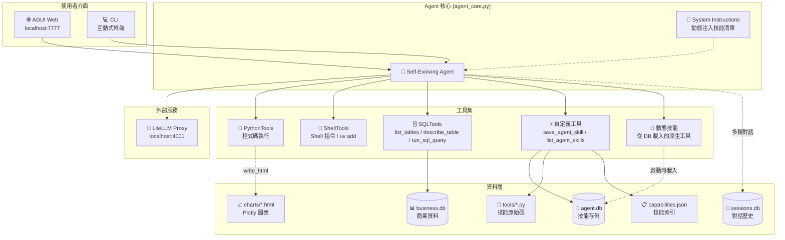
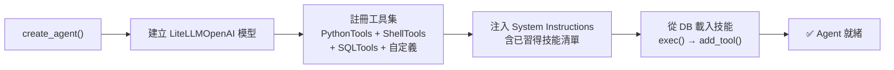
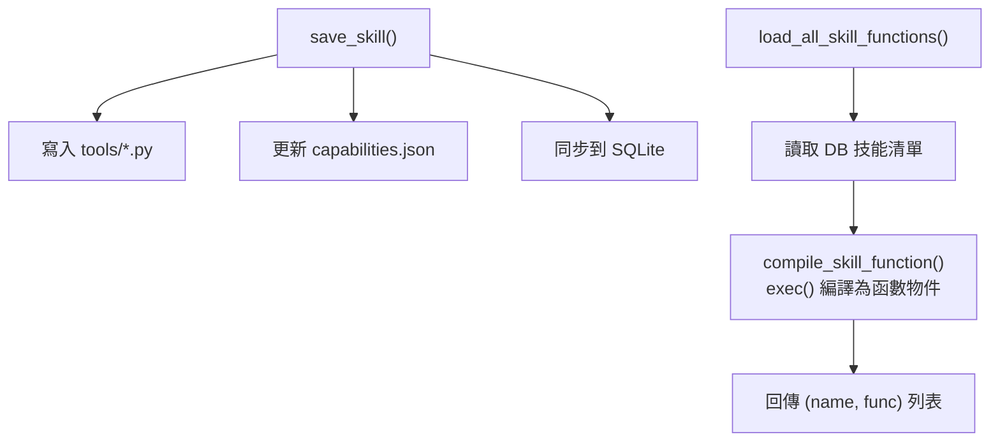
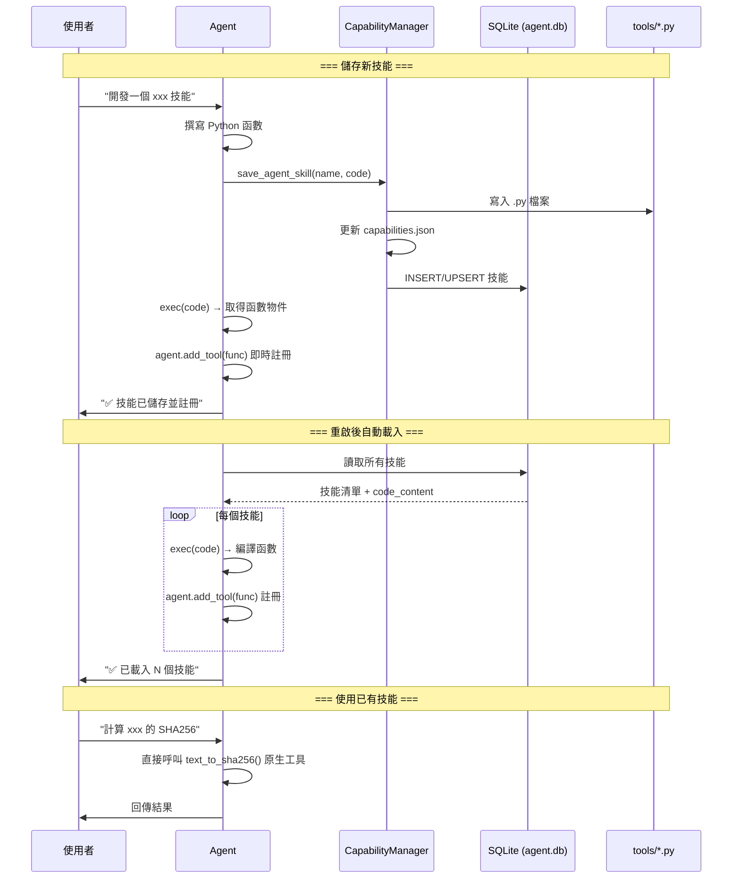
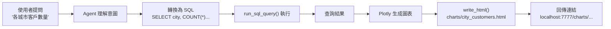

# 🧬 Self-Evolving Agent

> 基於 [Agno](https://agno.com) 框架的自我進化 AI Agent，具備 **技能記憶**、**錯誤自癒**、**動態工具擴充**、**自然語言資料庫查詢** 與 **資料視覺化** 能力。

---

## 📋 目錄

- [核心特色](#-核心特色)
- [系統架構](#-系統架構)
- [專案結構](#-專案結構)
- [快速開始](#-快速開始)
- [使用方式](#-使用方式)
- [重點模組說明](#-重點模組說明)
- [技能系統運作流程](#-技能系統運作流程)
- [資料庫查詢與視覺化](#-資料庫查詢與視覺化)
- [開發注意事項](#-開發注意事項)
- [測試範例](#-測試範例)
- [技術棧](#-技術棧)

---

## ✨ 核心特色

| 功能 | 說明 |
|------|------|
| 🧠 **技能記憶** | Agent 可將有用的函數儲存為技能，持久化到 SQLite，重啟後自動載入 |
| 🔧 **動態工具註冊** | 新技能透過 `exec()` 編譯後以 `agent.add_tool()` 即時註冊，無需重啟 |
| 🩹 **錯誤自癒** | 遇到 Traceback 時自動分析錯誤、修正程式碼並重試 |
| 💬 **自然語言查詢** | 用自然語言提問，Agent 自動轉換為 SQL 查詢商業資料庫 |
| 📊 **Plotly 視覺化** | 查詢結果自動生成互動式 Plotly 圖表，透過 Web 瀏覽 |
| 🔄 **多輪對話** | 使用 SQLite 儲存會話歷史，支援上下文延續 |

---

## 🏗 系統架構



---

## 📁 專案結構

```
agno_project/
├── .env                    # 環境變數 (LiteLLM 設定)
├── pyproject.toml          # uv 專案設定與依賴管理
├── app.py                  # 🌐 AGUI Web 介面入口
├── cli.py                  # 💻 CLI 互動式入口
├── agent_core.py           # 🤖 Agent 核心 (建立、工具、指令)
├── capability_manager.py   # 🧠 技能管理器 (檔案/索引/動態載入)
├── database.py             # 💾 技能 SQLite CRUD
├── business_db.py          # 📊 商業資料庫 (建表 + 模擬資料)
├── db_helper.py            # 🔗 共用 DB 查詢工具 (供技能 import)
├── verify.py               # 🧪 驗證腳本
├── tools/                  # Agent 自動生成的技能
│   ├── __init__.py
│   ├── capabilities.json   # 技能索引
│   └── *.py                # 各項技能原始碼
├── data/                   # SQLite 資料庫檔案
│   ├── agent.db            # 技能資料庫
│   ├── business.db         # 商業資料庫
│   └── sessions.db         # 對話歷史
└── charts/                 # Plotly HTML 圖表輸出目錄
```

---

## 🚀 快速開始

### 前置需求

- **Python** ≥ 3.13
- **[uv](https://github.com/astral-sh/uv)** — Python 專案管理工具
- **LiteLLM Proxy** — 運行於 `http://localhost:4001`

### 1. 安裝依賴

```powershell
cd D:\agy\agno_agent_project20260221\agno_project
uv sync
```

### 2. 設定環境變數

編輯 `.env` 檔案：

```env
# LiteLLM Proxy 設定
LITELLM_API_KEY=sk-1234
LITELLM_BASE_URL=http://localhost:4001/v1

# 預設模型 (可選: gpt-5-mini, deepseek-reasoner, deepseek-chat)
DEFAULT_MODEL=gpt-5-mini
```

### 3. 啟動 LiteLLM Proxy

> ⚠️ **必須先啟動 LiteLLM Proxy**，Agent 才能正常連線。

### 4. 啟動 Agent

```powershell
# 方式 1: AGUI Web 介面
uv run python app.py
# 開啟瀏覽器 → http://localhost:7777
# 圖表瀏覽 → http://localhost:7777/charts/

# 方式 2: CLI 互動式終端
uv run python cli.py
```

### 5. 驗證安裝

```powershell
uv run python verify.py
```

---

## 💡 使用方式

### AGUI Web 介面

啟動 `app.py` 後，開啟 http://localhost:7777，介面由 [Agno OS](https://os.agno.com) 提供。

### CLI 特殊指令

| 指令 | 功能 |
|------|------|
| `/skills` | 列出已習得技能 |
| `/reload` | 重新載入技能清單 |
| `/quit` | 結束程式 |

---

## 🔍 重點模組說明

### `agent_core.py` — Agent 核心

整個專案的樞紐，負責：



**關鍵設計**：
- `_agent_instance` 模組層級變數讓 `save_agent_skill` 可以即時呼叫 `agent.add_tool()` 動態註冊
- System Instructions 使用 `_build_system_instructions()` 動態組裝，包含技能清單與 DB Schema

### `capability_manager.py` — 技能管理器

管理技能的完整生命週期：



### `business_db.py` — 商業資料庫

首次載入時自動建立 5 張表並填充模擬資料：

| 表名 | 筆數 | 欄位 |
|------|------|------|
| `products` | 20 | id, name, category, unit_price, stock_quantity |
| `customers` | 50 | id, name, email, city, membership_level, join_date |
| `orders` | 300 | id, customer_id, order_date, total_amount, status |
| `order_items` | 742 | id, order_id, product_id, quantity, unit_price, subtotal |
| `employees` | 14 | id, name, department, position, salary, hire_date |

### `db_helper.py` — 共用查詢模組

供 Agent 生成的技能 import 使用（技能無法直接呼叫 Agent 層級的 SQLTools）：

```python
from db_helper import query, query_df

rows = query("SELECT * FROM products WHERE category = '手機'")  # → list[dict]
df = query_df("SELECT * FROM products")                          # → pandas DataFrame
```

---

## 🔄 技能系統運作流程



---

## 📊 資料庫查詢與視覺化



**圖表存取方式**：Agent 產生圖表後會提供 `http://localhost:7777/charts/<檔名>.html` 連結，在瀏覽器中可查看互動式 Plotly 圖表。

---

## ⚠️ 開發注意事項

### 套件安裝

```
❌ 不要用: pip_install_package 或 uv_pip_install_package
✅ 正確方式: run_shell_command(['uv', 'add', '套件名稱'])
```

PythonTools 內建的 pip 安裝在 `uv` 管理的虛擬環境中會失敗，Agent 的 System Instructions 已引導使用 ShellTools 執行 `uv add`。

### 技能撰寫規範

技能是獨立的 Python 模組，**不能**呼叫 Agent 層級的工具（如 `run_sql_query`）：

```python
# ❌ 錯誤 — 技能無法使用 Agent 工具
def my_skill():
    result = run_sql_query("SELECT * FROM products")  # Agent 工具, 不可用

# ✅ 正確 — 使用 db_helper
from db_helper import query

def my_skill():
    result = query("SELECT * FROM products")  # 直接連接 DB
```

### 多輪對話

Agent 使用 `SqliteDb` 儲存對話歷史（`data/sessions.db`），預設保留最近 **5 輪**對話：

```python
db=SqliteDb(db_file="data/sessions.db", session_table="agent_sessions"),
add_history_to_context=True,
num_history_runs=5,
```

### 環境變數

所有敏感設定放在 `.env`，透過 `python-dotenv` 載入：

| 變數 | 說明 | 預設值 |
|------|------|--------|
| `LITELLM_API_KEY` | LiteLLM 代理 API Key | `sk-1234` |
| `LITELLM_BASE_URL` | LiteLLM 代理 URL | `http://localhost:4001/v1` |
| `DEFAULT_MODEL` | 預設 LLM 模型 | `gpt-5-mini` |

---

## 🧪 測試範例

### 基礎對話
```
你好，介紹一下你的功能
```

### 建立技能
```
開發一個 text_to_sha256 技能，將字串轉為 SHA256 哈希值，
存入技能庫後計算 "Hello Agno" 的哈希。
```

### 使用已有技能
```
請使用已有的 text_to_sha256 技能計算 "test" 的哈希值
```

### 自然語言查詢
```
各產品類別的平均價格是多少？從高到低排列
```

### 查詢 + 畫圖
```
查詢 2024 年每月營收趨勢（只看完成訂單），用 Plotly 折線圖呈現，存到 charts 目錄
```

### 安裝套件
```
安裝 qrcode 和 Pillow，開發一個 generate_qrcode 技能存入技能庫
```

### 錯誤自癒
```
寫一段 Python 故意 import fake_module，觀察錯誤後自行修正
```

---

## 🛠 技術棧

| 類別 | 技術 |
|------|------|
| **AI 框架** | [Agno](https://agno.com) (Agent + AgentOS + AGUI) |
| **LLM 接口** | [LiteLLM](https://litellm.ai) Proxy + LiteLLMOpenAI |
| **Web UI** | Agno AGUI + [AG-UI Protocol](https://github.com/ag-ui-protocol) |
| **Web 框架** | FastAPI + Uvicorn |
| **資料庫** | SQLite (技能 / 商業資料 / 會話歷史) |
| **SQL 工具** | Agno SQLTools (SQLAlchemy) |
| **視覺化** | Plotly (互動式 HTML 圖表) |
| **環境管理** | [uv](https://github.com/astral-sh/uv) |
| **程式語言** | Python ≥ 3.13 |

---

## 📄 License

This project is for development and learning purposes.
